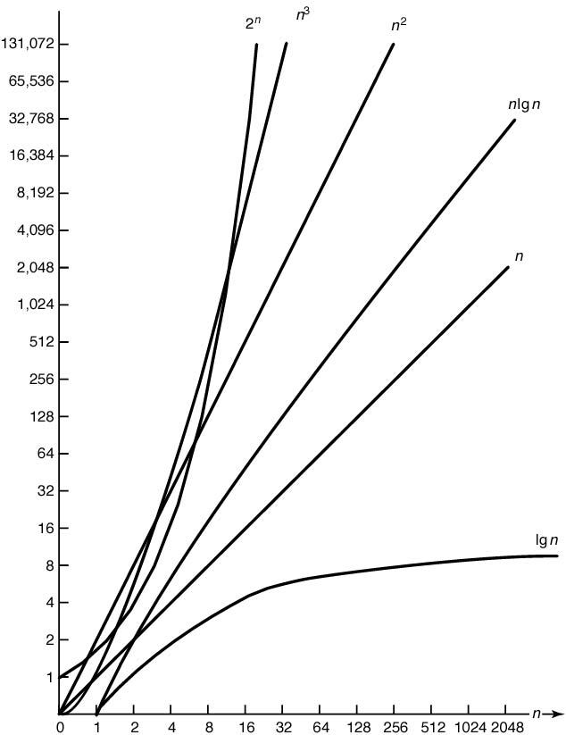

# 알고리즘

## 정의

문제를 해결할 수 있는 잘 정의된(well defined) 유한(finite)시간 내에 종료되는 계산적인 절차

입력을 받아서 출력으로 전환시켜주는 일련의 계산 절차

하나의 상태에서 다음 상태로 바뀌는 것은 반드시 결정적이어여 하는 것은 아니다. 
즉, 확률적 알고리즘과 같은 알고리즘은 무작위성을 포함한다.

> well defined : 누가 보더라도 그 의미가 정확하게 전달될 수 있는 방법을 의미
>
> finite : 한 시간, 하루 등 이런 개념이 아니라 무한 대의 개념과 반대를 의미

알고리즘과 Method의 차이

Algorithm : 유한시간 내에 종료

Method : 유한시간 내에 종료하는 지 모름

## 알고리즘 표기

1. 자연어
2. 프로그래밍 언어
3. 의사코드 (Pseudo-code)
  - pseudo: 실제와 비슷한, 진짜는 아니다

### 프로그래밍 언어와 의사코드의 차이점
* 배열 인덱스의 범위에 제한 없음
  - C++는 반드시 0부터 시작

## 시간 복잡도와 공간 복잡도
시간 복잡도 : 입력크기에 따라서 단위연산이 몇 번 수행되는 지 결정
공간 복잡도 : 입력크기에 따라서 작업공간이 얼마나 필요한 지 결정

### 분석 방법 종류

1. **모든 경우 분석**
    * 입력 크기에만 종속
    * 입력 값과는 무관하게 결과 값은 항상 일정

2. **최악의 경우 분석** (주요 관심)
    * 입력 크기, 입력 값 둘다 종속
    * 수행 횟수가 최대인 경우

3. **평균의 경우 분석**
    * 입력 크기에 종속
    * 모든 입력에 대해 단위 연산이 수행되는 기대치

4. **최선의 경우 분석**
    * 입력 크기, 입력 값 둘다 종속
    * 수행 횟수가 최소인 경우

### big-O 표기법
점근적 실행 시간을 표기할 때 가장 널리 쓰이는 수학적 표기법 중 하나

> Asymptotic : 입력값 n이 커질 때, 즉 입력값이 무한대를 향할 때 limit 함수의 실행 시간의 추이를 의미

### 점근적 실행 시간 (Asymptotic Running Time)

> 입력값 n이 커질 때, 즉 입력값이 무한대를 향할 때 limit 함수의 실행 시간의 추이를 의미

점근적 표기 방식에 따라,
* 최선 - Big-Ω Notation (빅 오메가)
* 평균 - Big-θ Notation (빅 세타)
* 최악 - Big-O Notation (빅 오)

위 세 가지 방식으로 시간 복잡도를 나타낸다.
이 중에서도 

점근적 표기 방식에 따라,
* Big-Ω Notation (빅 오메가) - lower bound
* Big-θ Notation (빅 세타) - 
* Big-O Notation (빅 오) - Upper bound
* Small-o Notation (스몰 오) - 

### 종류

  

