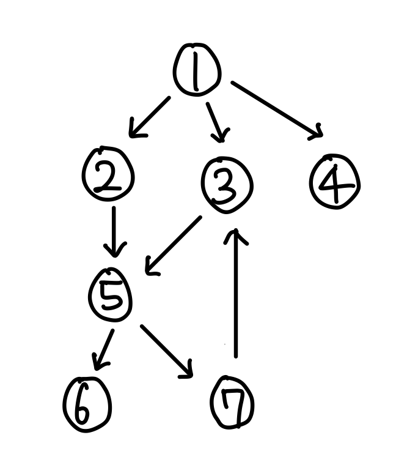

# Breadth First Search (너비 우선 탐색)

> *트리나 그래프에서 한 정점으로 탐색하다가 시작 정점에 인접한 모든 정점들을 우선 탐색하는 방식*

<br>

## 특징

<p align="center">
  
</p>

* 두 vertex 사이의 최단 경로 혹은 임의의 경로를 찾고 싶을 때 이 방법을 선택한다.
  > 지구상에 존재하는 모든 친구 관계를 그래프로 표현한 후 Ash와 Vanessa 사이에 존재하는 경로를 찾는 경우  
  > ① DFS - 모든 친구 관계를 다 살펴봐야 할지도 모른다.  
  > ② BFS - Ash와 가까운 관계부터 탐색  

* BFS는 재귀적으로 동작하지 않으며, 반복구조로 구현할 때는 Queue를 이용한다.

* DFS가 BFS보다 좀 더 간단하지만, 단순 검색 속도 자체는 BFS에 비해서 느리다.

<br>

## 알고리즘 설계 및 구현

<p align="center">
  
</p>

### 큐를 이용한 반복 구조로 구현

1. 먼저 시작 정점인 1을 방문한 다음, 큐에 삽입한다.

2. 정점 1의 인접 정점인 {2, 3, 4}를 차례대로 방문한 다음, 큐에 삽입한다.

3. 큐에 삽입된 {2, 3, 4} 순으로 큐에서 삭제하면서 인접한 정점에 방문 가능한지 확인한다.

4. {2}의 인접한 정점 {5}는 방문하지 않았으므로 방문한 후 큐에서 삭제한다.

5. {3}의 인접한 정점 {5}는 이미 방문했으므로 큐에서 삭제한다.

6. 앞의 순서와 마찬가지로 모든 노드를 방문하고, 탐색을 종료한다.

```python
from collections import deque

def bfs(graph: dict, start_vertex: any) -> list[any]:
    visited = [start_vertex]        # visited : 방문한 vertex를 담고있는 리스트
    queue = deque([start_vertex])   # dfs는 queue를 이용
    
    while queue:  # queue에 남은 것이 없을 때까지 반복
        vertex = queue.popleft()  # vertex : 현재 방문하고 있는 vertex
        
        # 현재 vertex의 자식 vertex들 탐색
        for w in graph[vertex]:
            # 현재 vertex를 방문한 적 없는 경우
            if w not in visited:
                visited.append(w)
                queue.append(w)
    return visited

# 1 -> 2 -> 3 -> 4 -> 5 -> 6 -> 7
```

<br>

## 전체 코드
- [bfs.py](./src/bfs.py)