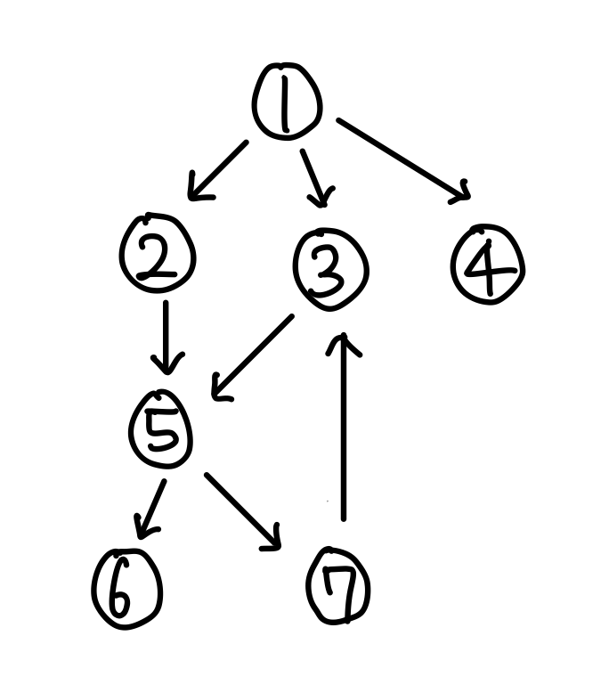

# Depth First Search (깊이 우선 탐색)

> *트리나 그래프에서 한 정점으로 탐색하다가 특정 상황에서 최대한 깊숙히 들어가서 확인한 뒤 다시 돌아가 다른 루트로 탐색하는 방식*

<br>

## 특징

<p align="center">
  
</p>

* 모든 vertex를 탐색하고자 하는 경우에 이 방법을 선택한다.
  > 지구상에 존재하는 모든 친구 관계를 그래프로 표현한 후 Ash와 Vanessa 사이에 존재하는 경로를 찾는 경우  
  > ① DFS - 모든 친구 관계를 다 살펴봐야 할지도 모른다.  
  > ② BFS - Ash와 가까운 관계부터 탐색  

* DFS는 스택으로 구현하며, 재귀를 이용하면 좀 더 간단하게 구현할 수 있다.

* DFS가 BFS보다 좀 더 간단하지만, 단순 검색 속도 자체는 BFS에 비해서 느리다.

<br>

## 알고리즘 설계 및 구현

<p align="center">
  
</p>

### 재귀 구조로 구현
> 사전식 순서로 탐색

```python
def dfs_recursive(graph: dict, vertex: any, visited=[]) -> list[any]:
    visited.append(vertex)
    
    for node in graph[vertex]:
        if node not in visited:
            dfs_recursive(graph, node, visited)
    
    return visited

# 1 -> 2 -> 5 -> 6 -> 7 -> 3 -> 4
```

### 스택을 이용한 반복 구조로 구현
> 사전식 순서의 역순으로 탐색하여 재귀 DFS랑 순서가 다르다.  
> 스택을 사용함으로써 가장 마지막에 삽입된 노드부터 꺼내서 반복

```python
def dfs_iteration(graph: dict, start_vertex: any):
    visited = []            # visited : 방문한 vertex를 담고있는 리스트
    stack = [start_vertex]  # dfs의 반복 구현은 stack을 이용
    
    while stack:  # 스택에 남은것이 없을 때까지 반복
        vertex = stack.pop()  # vertex : 현재 방문하고 있는 vertex
        
        # 현재 vertex를 방문한 적 없는 경우
        if vertex not in visited:
            visited.append(vertex)
            for w in graph[vertex]:  # 현재 vertex의 자식 vertex들을 stack에 추가
                stack.append(w)
    
    return visited

# 1 -> 4 -> 3 -> 5 -> 7 -> 6 -> 2
```

<br>

## 전체 코드
- [dfs.py](./src/dfs.py)