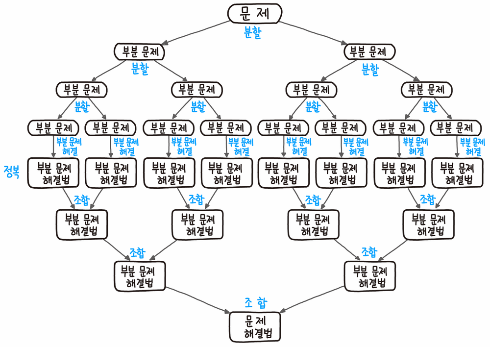

# Divide-and-Conquer (분할 정복법)

> *직접 해결할 수 있을 정도로 간단한 문제가 될 때까지 문제를 재귀적으로 쪼개나간 다음, 그 하위 문제의 결과들을 조합하여 원래 문제의 결과로 만들어 내는 설계 기법*

 

## 특징

  

* 특정한 하나의 알고리즘이 아닌 <u>**설계 기법**</u>이다.

* 분할 정복은 말 그대로 문제를 **분할**해서 **정복**한 다음 정답을 **조합**해 나가는 의미

* **재귀**를 활용하는 대표적 설계 기법

 

## 알고리즘 설계 절차

* **분할(Divide)**
  - 문제를 동일한 유형의 여러 하위 문제로 나눈다.

* **정복(Conquer)**
  - 가장 작은 단위의 하위 문제를 해결하여 정복한다.

* **조합(Combine)**
  - 하위 문제에 대한 결과를 원래 문제에 대한 결과로 조합한다.

 

> 이러한 문제 해결 방법을 하향식(Top-down) 접근방법이다.

 

## 대표적 알고리즘

* Binary Search

* Merge Sort

* Quick Sort