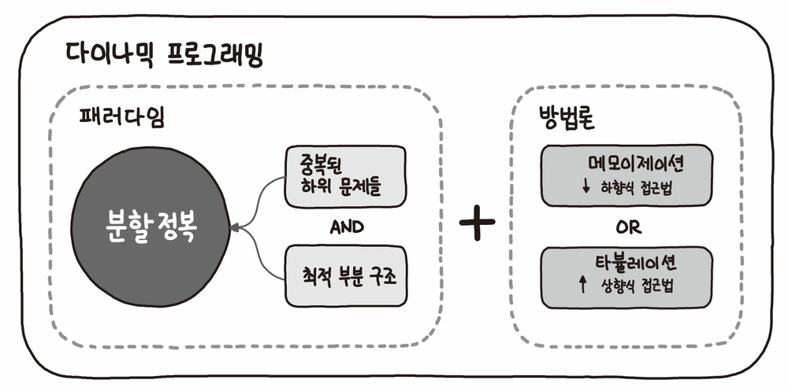

# Dynamic Programming (동적 계획법)

> *문제를 각각의 작은 문제로 나누어 해결한 결과를 저장해뒀다가, 나중에 큰 문제의 결과와 합하여 풀이하는 설계 기법*

<br>

## 접근 방식

커다란 문제를 쉽게 해결하기 위해 작게 쪼개서 해결하는 방법인 **분할 정복**과 매우 유사하다.

하지만 간단한 문제로 만드는 과정에서 **중복된 하위 문제들의 결과 여부**에 대한 차이점이 존재한다.

즉, 다이나믹 프로그래밍은 간단한 작은 문제들 속에서 **계속 반복되는 연산**을 활용하여 빠르게 풀 수 있는 것이 핵심이다.

<br>

### 최적 부분 구조 (Optimal Substructure)

> *작은 문제에서 반복이 일어남*

* 최적 부분 구조은 답을 구하기 위해 이미 했던 똑같은 계산을 계속 반복하는 문제 구조이다.

* 이런 유형의 문제는 분할 정복으로 풀 수 있다. 또한 다이나믹 프로그래밍 또는 그리디 알고리즘으로 접근해볼 수 있는 문제의 후보가 된다.

### 중복된 하위 문제들 (Overlapping Subproblem)

> *같은 문제는 항상 정답이 같음*

* 다이나믹 프로그래밍으로 풀 수 있는 문제들과 다른 문제들의 결정적인 차이는 **중복된 하위 문제들**을 갖는다는 점이다.

* 합병정렬, 퀵 정렬과 같은 분할 정복 알고리즘은 **중복된 하위 문제들**을 푸는 것이 아니기 때문에 다이니믹 프로그래밍이 아니다.

<br>

| 접근법              | 특징                                         | 대표적 알고리즘                      |
| :-----------------: | :------------------------------------------: | :----------------------------------: |
| Divide and Conquer  | __최적 부분 구조__                           | 합병 정렬<br> 퀵 정렬                |
| Greedy Algorithm    | __최적 부분 구조__<br> __탐욕 선택 속성__    | 다익스트라 알고리즘                  |
| Dynamic Programming | __최적부분 구조__<br> __중복된 하위 문제들__ | 피보나치 수열<br>다익스트라 알고리즘 |

<br>

## 방법론

<p align="center">
  
</p>

<br>

* Bottom-up (상향식) `Tabulation` `Dynamic Programming`
  - 더 작은 하위 문제부터 살펴본 다음, 작은 문제의 정답을 이용해 큰 문제를 해결하는 방법
  - 데이터를 테이블 형태로 만들면서 풀이한다고 하여 **Tabulation**이라 부르며, 일반적으로 이 방식만을 **Dynamic Programming**이라 한다.

* Top-down (하향식) `Memoization`
  - 큰 문제를 풀다가 풀리지 않은 작은 문제가 있다면 그때 해결하는 방법(재귀 방식)
  - 한 번 계산한 문제는 다시 계산하지 않도록 저장해두고 활용하는 방식이라 하여 **Memoization**이라 지칭한다.

<br>

> Bottom-up은 해결이 용이하지만, 가독성이 떨어진다.
>
> Top-down은 가독성이 좋지만, 코드 작성이 힘들다.

<br>

### 예시 - 피보나치 수열

피보나치 수열은 아래의 식과 같이 **반복적으로 동일한 하위 문제들이 발생**하여, 다이나믹 프로그래밍으로 접근할 수 있다.

```
f(5) = f(4) + f(3) = 5
       |      |
       |      f(3) = f(2) + f(1) = 2
       |             |      |
       |             |      f(1) = 1
       |             |
       |             f(2) = 1
       |
       f(4) = f(3) + f(2) = 3
              |      |
              |      f(2) = 1
              |
              f(3) = f(2) + f(1) = 2
                     |      |
                     |      f(1) = 1
                     |
                     f(2) = 1
```

1. Brute-force
> 재귀를 이용한 기본적인 풀이

```python
def fib_bruteforce(n: int) -> int:
    if n <= 1:
        return n

    return fib_bruteforce(n-1) + fib_bruteforce(n-2)
```

2. Bottom-Up `tabulation`
> 작은 하위 문제부터 차례대로 정답을 풀어나가며 큰 문제의 정답을 만든다.  
> 재귀를 사용하지 않고 반복으로 풀이

```python
import collections
dp = collections.defaultdict(int)

def fib_tabulation(n: int) -> int:
    dp[1] = 1

    for i in range(2, n + 1):
        dp[i] = dp[i - 1] + dp[i - 2]

    return dp[n]
```

3. Top-Down `memoization`  
> 하위 문제에 대한 정답을 계산했는지 확인해가며 문제를 자연스럽게 재귀로 풀어나간다.  
> 기존 재귀 풀이와 거의 동일하면서도 이미 풀어봤는지 확인하여 재 활용하는 효율적인 방식

```python
import collections
dp = collections.defaultdict(int)

def fib_memoization(n: int) -> int:
    if n <= 1:
        return n

    if dp[n] == True:
        return dp[n]

    dp[n] = fib_memoization(n-1) + fib_memoization(n-2)
    
    return dp[n]
```

<br>

## 문제 해결 방법

동적 계획법으로 문제를 풀 때는, 우선 작은 문제부터 해결해 나가보는 것이 좋다.

작은 문제들을 풀어나가다보면, 이전에 구해둔 더 작은 문제들이 활용되는 것을 확인하게 된다.

이에 대한 규칙을 찾았을 때, **점화식**을 도출해내어 동적 계획법을 적용시키자

<br>

## 대표적 알고리즘

* [피보나치 수열 (fibonacci sequence)](./src/fibonacci.py)

* [이항 계수 (binomial coefficient)](./binomial_coefficient.md)

* [플로이드-워셜 알고리즘 (floyd-warshall algorithm)](./floyd_warshall.md)

* [최적 이진 탐색 트리 (optimal-BST)](./optimal_bst.md)