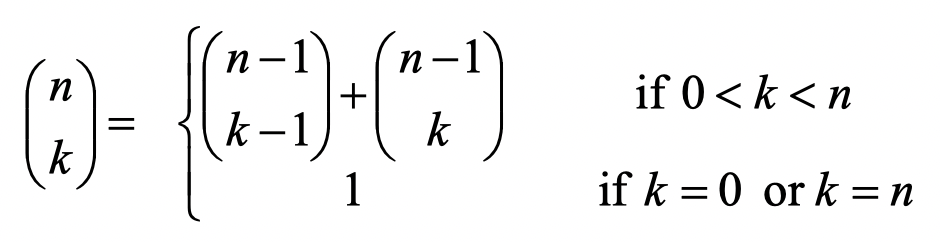
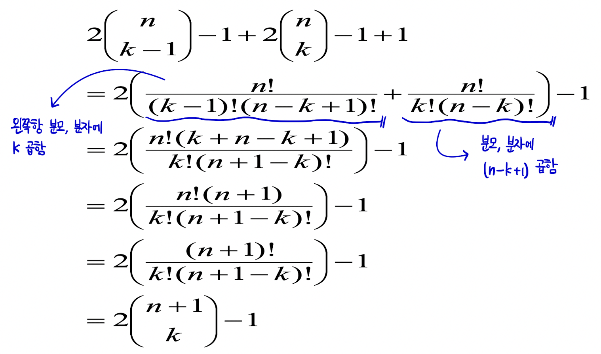
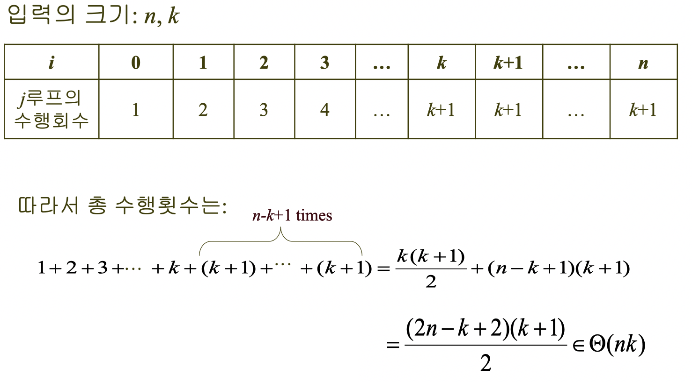

# Binary-Coefficient (이항계수)

> 이항계수의 두 가지 접근법을 알아보자

<br>

## 접근 방식

이항 계수의 점화식은 다음과 같다.

<p align="center">
  
</p>

<br>

이를 살펴보면 **최적 부분 구조**, **중복된 하위 문제들**을 가져 **Dynamic Programming**으로 해결할 수 있다.

```
bin(3, 1) = bin(2, 0) + bin(2, 1)
            |           |
            |           |
            |           bin(2, 1) = bin(1, 0) + bin(1, 1)
            bin(2, 0) = 1           |           |
                                    |           |
                                    |           bin(1, 1) = 1
                                    |
                                    bin(1, 0) = 1
```

<br>

## 알고리즘 설계 및 구현

### Top-down
> 분할 정복 접근법으로, 큰 문제를 풀다가 풀리지 않은 작은 문제가 있다면 그때 해결하는 방법 (재귀 방식)

```python
def bin(n: int, k: int) -> int:
    if k == 0 or n == k:
        return 1
    else:
        return bin(n-1, k-1) + bin(n-1, k)

# Testcase
print(bin(10, 5))
```

<br>

### Bottom-Up
> 다이나믹 프로그래밍 접근법으로, 더 작은 하위 문제부터 살펴본 다음, 작은 문제의 정답을 이용해 큰 문제를 해결하는 방법 (반복 방식)

```python
from numpy import *
import numpy as np

def bin2(n: int, k: int) -> int:
    matrix = np.empty((n+1, n+1))
    for i in range(n+1):
        for j in range(min(i, k) + 1):
            if j == 0 or j == i:
                matrix[i][j] = 1
            else:
                matrix[i][j] = matrix[i-1][j-1] + matrix[i-1][j]
    return matrix[n][k]

# Testcase
print(bin2(10, 5))
```

<br>

## 시간 복잡도

### Top-down

**1. 귀납 가정**

  -  를 구하기 위해서 이 알고리즘이 계산하는 항의 개수는  라 가정하자.

**2. 귀납 절차**

  -  를 계산하기 위한 항의 개수가  을 보이면 된다.
  - 알고리즘에 의해  이므로,

    1.  을 계산하기 위한 
    2.  을 계산하기 위한 
    3. 이 둘을 더하기 위한 항 1

<p align="center">
  
</p>

### Bottom-Up

Bottom-Up에 대한 시간복잡도는 다음과 같다.
<p align="center">
  
</p>

<br>

## 참고 사이트

* https://jaeuk2274.tistory.com/53?category=686913