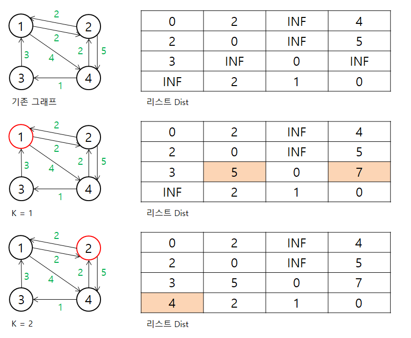
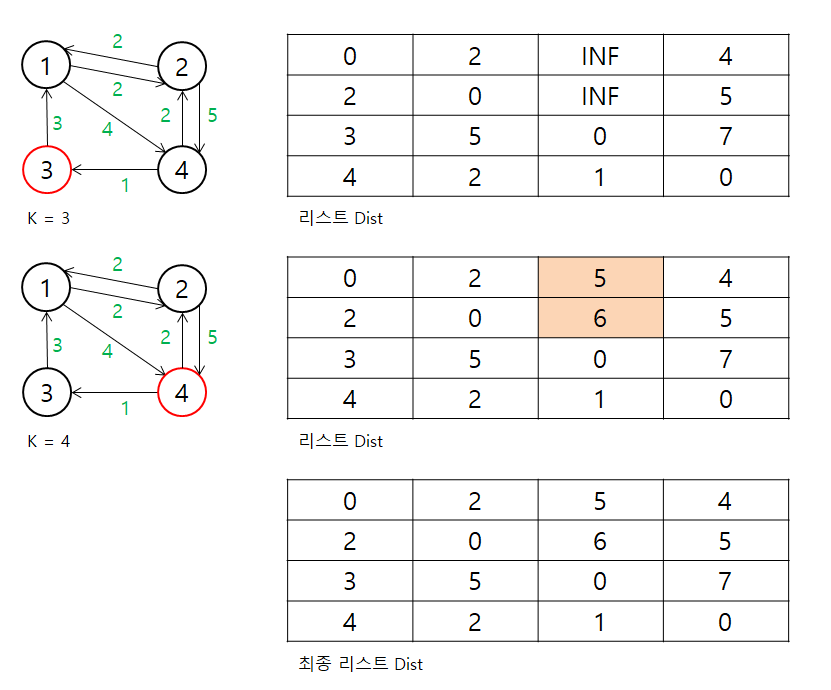
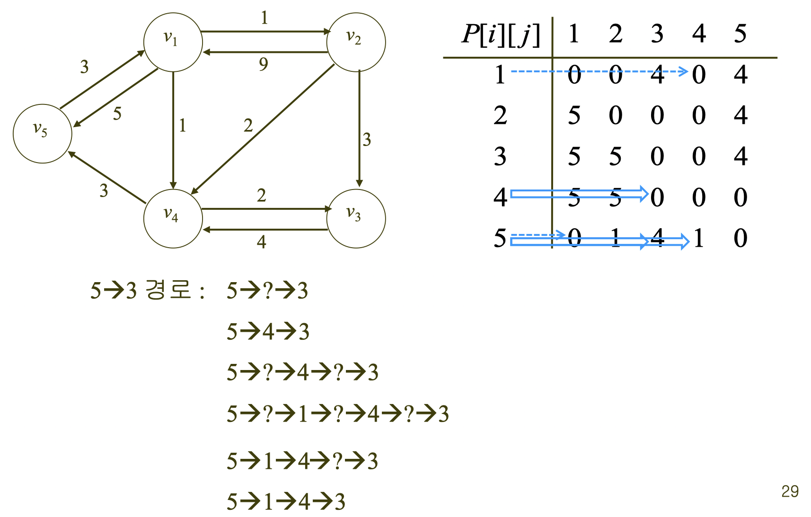

# Floyd Warshall Algorithm (플로이드-워셜)

> 모든 정점 사이의 최단 거리를 찾는 탐색 알고리즘

<br>

## 아이디어

* 두 정점 사이의 최단 경로는 **다른 한 정점을 거치거나**, **거치지 않는 경로** 중 하나이다.

* 만약 경유지를 거친다면 최단 경로를 이루는 부분 경로 역시 최단 경로이다. 바꿔 말해 A - B의 최단 경로가 A-K-B라면 A-K와 K-B도 각각 최단 경로이다. *(Optimal Substructure)*

<br>

## 알고리즘 설계 및 구현

1. 한 정점에서 다른 정점으로 바로 갈 수 있으면 최소거리를, 갈 수 없으면 INF값을 담고 있는 2차원 행렬 D을 초기화한다.

2. 각 정점이 경유지 K를 지날 때마다 최단 거리를 계산하여 행렬 D를 갱신한다.

3. Dynamic Programming으로 해결하며, 점화식은 `D[i][j] = min(D[i][j], D[i][k] + D[k][j])` 이다.

<br>

## 시간 복잡도

모든 가능한 경유지에 대해서 모든 정점 모든 정점으로 가는 최단 거리를 확인하므로, 시간복잡도는 `O(n^3)` 이다.

<br>

## 예시

<p align="center">
  
</p>

<p align="center">
  
</p>

<br>

## 코드 - Python

``` python
import copy

# Floyd-Warshall Algorithm: 모든 정점에서 모든 정점까지의 최단 경로 알고리즘
def floyd_warshall(g: list[list[int]], n: int) -> list[list[int]: 
    dist = copy.deepcopy(g)  # dist: 최단 경로의 길이를 담은 행렬

    for k in range(0, n):  # 거치는 점
        for i in range(0, n):  # 시작점
            for j in range(0, n):  # 끝점
              dist[i][j] = min(dist[i][j], dist[i][k] + dist[k][j])
    return dist

# print 2-D Matrix
def printMatrix(d: list[list[int]]) -> None:
    n = len(d[0])
    
    for i in range(0, n):
        for j in range(0, n):
            print(d[i][j], end=' ')
        print()

# Testcase
INF = 1000
g = [ [0, 1, INF, 1, 5],
      [9, 0, 3, 2, INF],
      [INF, INF, 0, 4, INF],
      [INF, INF, 2, 0, 3],
      [3, INF, INF, INF, 0] ]
      
dist = floyd_warshall(g, 5)
printMatrix(dist)
```

<br>

## Floyd's Algorithm을 통한 최단 경로 출력

**Optimal Substructure**을 활용하면 경유하는 정점들을 알 수 있다.

P[i][j] = 중간에 정점이 없으면 0, 있으면 그 중 가장 큰 인덱스

### 예시

<p align="center">
  
</p>

```
  path(5, 3) = 4
      path(5, 4) = 1
          path(5, 1) = 0
          v1
          path(1, 4) = 0
      v4
      path(4, 3) = 0

즉, v5에서 v3까지 최단 경로는 v5 -> v1 -> v4 -> v3 이다.
```

### 코드

```python
# Floyd-Warshall 알고리즘을 통한 최단 경로를 구성하는 정점 기록
def floyd_warshall_2(g: list[list[int]], n: int):
    dist = copy.deepcopy(g)
    p = [[0] * n for _ in range(n)]  # p: 중간에 정점이 없으면 0, 있으면 그 중 가장 큰 인덱스를 포함한 행렬

    for k in range(0, n):
        for i in range(0, n):
            for j in range(0, n):
                if dist[i][k] + dist[k][j] < dist[i][j]:
                    p[i][j] = k + 1  # 경로 중 가장 큰 인덱스 저장
                    dist[i][j] = dist[i][k] + dist[k][j]
    return dist, p

# print 2-D Matrix
def printMatrix(d: list[list[int]]) -> None:
    n = len(d[0])
    
    for i in range(0, n):
        for j in range(0, n):
            print(d[i][j], end=' ')
        print()

# 특정 두 정점 사이의 최단 경로 출력
def printPath(p: list[list[int]], q: int, r: int) -> None:
    if p[q-1][r-1] != 0:  # 최단 경로가 경유지를 지날 경우
        printPath(p, q, p[q-1][r-1])  # 시작 정점에서 경유하는 정점까지의 경로 검사
        print(f'v{p[q-1][r-1]}', end=' ')
        printPath(p, p[q-1][r-1], r)  # 경유하는 정점에서 끝 정점까지의 경로 검사

# Testcase
INF = 1000
g = [ [0, 1, INF, 1, 5],
      [9, 0, 3, 2, INF],
      [INF, INF, 0, 4, INF],
      [INF, INF, 2, 0, 3],
      [3, INF, INF, INF, 0] ]
      
d, p = floyd_warshall_2(g, 5)
print()
printMatrix(d)
print()
printMatrix(p)
print()
printPath(p, 5, 3)
```

<br>

## 전체 코드

- [floyd_warshall.py](./src/floyd_warshall.py)