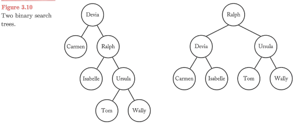
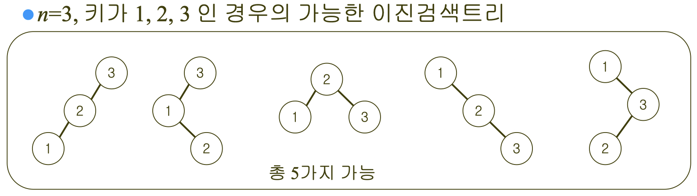
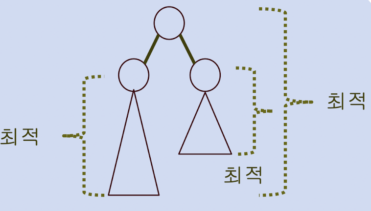
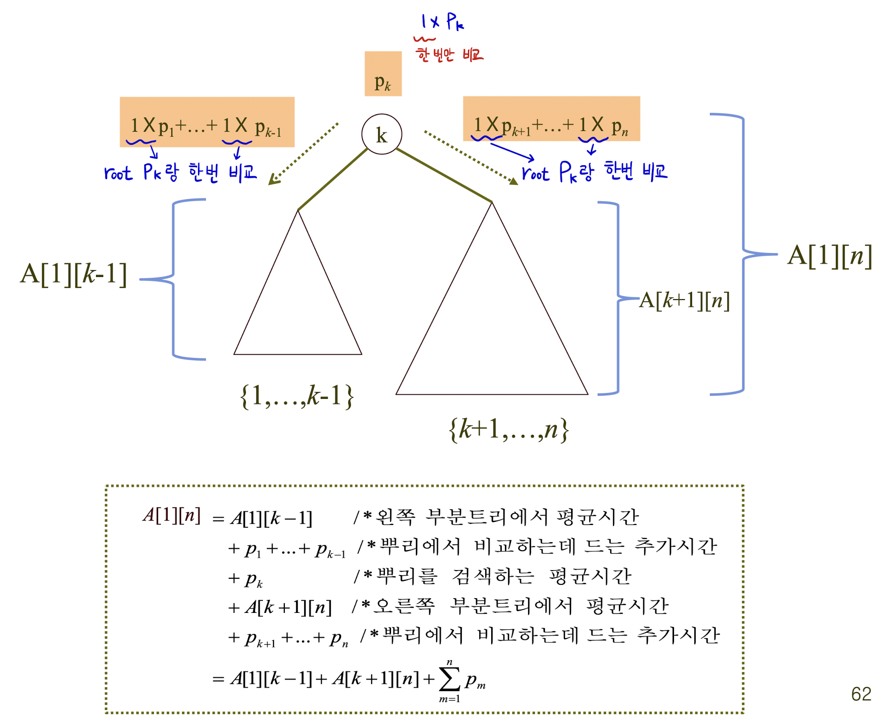
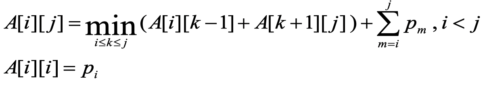
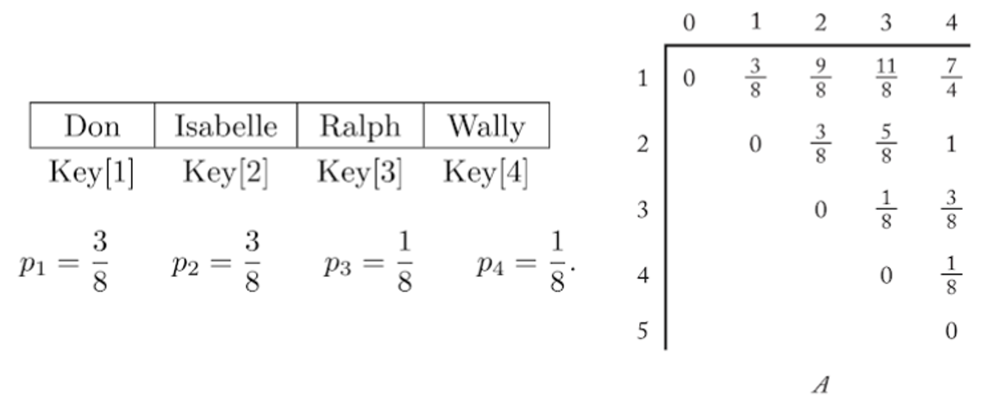
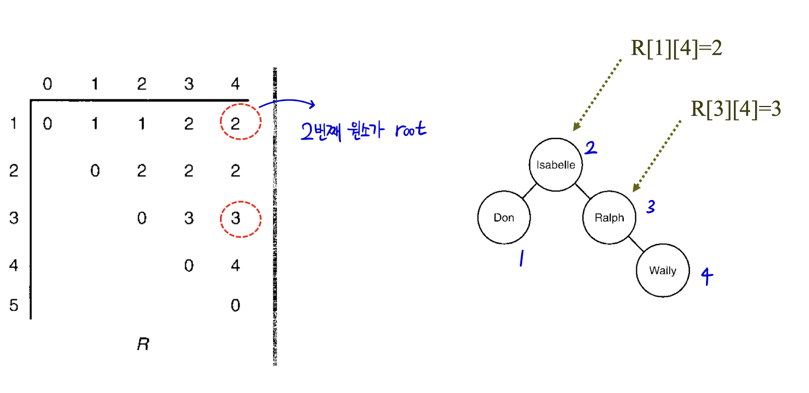

# Optimal Binary Search Tree (최적 이진탐색 트리)

> 가능한 BST의 모양들 중에서 평균 검색 시간이 제일 낮은, 가장 효율적인 트리를 찾는 탐색 알고리즘

<br>

## 언제 쓰이는 가

문서에 중복이 허용된 여러개의 영어단어가 존재하는데 이를 한글로 번역해서 저장하는 프로그램을 필요로 한다고 가정하자.  

먼저, 문서에 있는 각각의 영어단어에 접근하고, 이에 해당하는 한글 단어를 찾아야 한다.  

이 때, **Optimal Binary Search Tree**를 활용하면 된다.

<p align="center">
  
</p>

## 아이디어

### 평균 탐색 시간

각 키를 찾을 확률이 주어져 있을 때 키를 찾는데 걸리는 평균시간이 최소가 되도록 이진트리를 구축 가능하다.

단어의 검색 빈도를  , 단어를 검색하는데 필요한 비교 횟수를
  이라고 하면, **평균 탐색시간 계산식**은 다음과 같다.

<p align="center">
  
</p>

Node의 갯수가 3개이며, 각각의 Node가 검색될 확률 `p1 = 0.7, p2 = 0.2, p3 = 0.1` 이라 가정하면, 가능한 BST의 모양은 다음과 같다.

<p align="center">
  
</p>

위의 계산식을 활용하면 5번의 BST가 최적 이진탐색 트리라고 알 수 있다.

> 1. 3 * 0.7 + 2 * 0.2 + 1 * 0.1 = 2.6
> 2. 2 * 0.7 + 3 * 0.2 + 1 * 0.1 = 2.1
> 3. 2 * 0.7 + 1 * 0.2 + 2 * 0.1 = 1.8
> 4. 1 * 0.7 + 3 * 0.2 + 2 * 0.1 = 1.5
> 5. 1 * 0.7 + 2 * 0.2 + 3 * 0.1 = 1.4

### 동적 계획법

그렇다면 최적 이진탐색 트리를 어떻게 찾아낼까?  
위의 예시처럼 가능한 모든 BST의 모양을 만드는 것은 비효율적이다.  
BST를 다시 보면, 특성상 최적 트리의 부분트리는 그 부분트리 안에 있는 키들에 대해서 반드시 최적을 알 수 있다.

<p align="center">
  
</p>

즉, **최적 부분 구조**와 **중복된 하위 문제들** 특성을 가져 **동적 계획법**으로 접근할 수 있다.

<br>

## 알고리즘 설계 및 구현

### 점화식

<p align="center">
  
</p>

1. n개의 key가 있고, 그 중 k번째 key가 루트인 Tree가 있다고 하자

2. 그러면, BST에서 key를 찾을 때 걸리는 평균 탐색 시간은  
**왼쪽 서브트리에서 찾는 시간** + **오른쪽 서브트리에서 찾는 시간** + **루트를 탐색하는 시간**이다.

3. 점화식으로 나타내면, 다음과 같다.

    > 

### 최적 이진탐색 모양 구축

이 점화식을 이용해서 A라는 2차원 배열을 채워나가서, A[1][n] 의 값을 얻으면 그것이 최적 BST의 평균 검색 시간이 된다. 다만 A라는 DP 배열 하나만으로는 최적값은 구할 수 있지만, 최적 BST의 모양을 알 수가 없다. 최적 BST를 구성하기 위한 아이디어는 R이라는 2차원 배열을 하나 더 만드는 것이다.

여기서 R의 각 칸에 들어가는 값은 A 배열에 최적값을 넣는 순간의 k값으로, 이는 즉 i번째 key부터 j번째 key까지를 이용해 BST를 만들 때 루트가 되는 노드의 번호를 의미한다. 즉 R[1][n] 을 구하면 최적 BST의 루트노드를 구할 수 있다.

그 다음 레벨의 노드부터는? 루트가 된 노드가 k번 노드라고 치면 그 왼쪽 서브트리의 루트노드 (즉 k번 노드의 left child) 는 R[1][k-1], 오른쪽 서브트리의 루트노드는 R[k+1][n] 이 된다. 이런 식으로 R 배열의 값들을 이용해 재귀함수를 호출해주면서 노드를 만들어나가면 최적 BST가 만들어진다.

<p align="center">
  
  
</p>

<br>

## 시간 복잡도

Optimal BST의 시간 복잡도는 O(n^3)이다.

<br>

## 코드 - Python
```python
class Node:
    def __init__(self, data: any):
        self.l_child: Node = None
        self.r_child: Node = None
        self.data = data

# Optimal-BST Algorithm: 평균 검색 시간이 제일 낮은, 가장 효율적인 BST를 찾는 탐색 알고리즘
def opt_search_tree(p: list[int]):
    # 가로축은 0 ~ n, 세로축은 1 ~ n+1
    n = len(p) - 1
    dp = [[0 for _ in range(n+2)] for _ in range(n+2)]  # dp[i][j] : min(dp[i][k-1] + dp[k+1][j]) + sum(p[i] ~ p[j]) (i <= k <= j, p[i]: i가 검색키일 확률)
    R = [[0 for _ in range(n+2)] for _ in range(n+2)]   # R[i][j] : i에서 j까지의 Node중 root인 Node의 번호

    # Initialize 2-D Matrix dp, R
    for i in range(1, n+1):
        dp[i][i-1] = 0      # 주 대각선 원소는 0
        dp[i][i] = p[i]     # 자기 자신 검색시간 = 1 * 자기 자신이 검색키일 확률
        R[i][i] = i         # 자기 자신의 트리의 루트는 자기 자신이다.
        R[i][i-1] = 0       # 주 대각선 원소는 0
    dp[n+1][n] = 0  # 주 대각선 원소중 마지막 원소를 0
    R[n+1][n] = 0   # 주 대각선 원소중 마지막 원소를 0

    for diagonal in range(1, n):  # 진행 순서가 주 대각선 기준에서 위로 올라간다.
        for i in range(1, n-diagonal+1):  # 기준 대각선에서 윗쪽 원소만 채움
            j = i + diagonal
            min_result = 99999  # 절대 될 수 없는 값으로 초기화
            min_k = 0           # k중 최소값을 가진 min_k 초기화

            # dp[i][k-1] + dp[k+1][j]의 최소값과 그 때의 k를 찾는 과정
            for k in range(i, j+1):  # i <= k <= j
                if (dp[i][k-1] + dp[k+1][j]) < min_result:
                    min_result = dp[i][k-1] + dp[k+1][j]
                    min_k = k

            dp[i][j] = min_result + sum(p[i : j+1]) # dp[i][j] = min(dp[i][k-1] + dp[k+1][j]) + sum(pi ~ pj)
            R[i][j] = min_k                         # R[i][j] = Root가 되는 Node의 번호    
    return dp, R

# R행렬을 이용해 Optimal-BST를 구축하는 Function
def tree(key: list[any], R: list[list[int]], i: int, j: int) -> Node:
    k = R[i][j]

    if k == 0:
        return
    else:
        p = Node(key[k])
        p.l_child = tree(key, R, i, k-1)
        p.r_child = tree(key, R, k+1, j)
        
        return p

# Testcase
key = [" ", "A", "B", "C", "D", "E"]
p = [0, 4/15, 5/15, 1/15, 3/15, 2/15]  # p[i] : key[i]가 검색키일 확률
dp, R = opt_search_tree(p)
root = tree(key, R, 1, 5)
```

## 참고 사이트

* https://gsmesie692.tistory.com/116

<br>

## 전체 코드

- [optimal_bst.py](./src/optimal_bst.py)