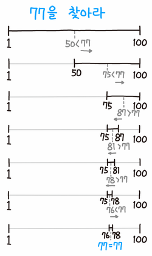

# Binary Search (이진 탐색)

> *정렬된 배열에서 타겟을 찾는 검색 알고리즘*

<br/>

## 특징

<p align="center">
  
</p>

* 검색 범위를 줄여 나가면서 원하는 데이터를 검색하는 알고리즘

* 반드시 **정렬된** 배열에서 사용해야 한다.

* 선형 탐색에 비해 **탐색 속도가 빠르다.**

<br/>

## 시간 복잡도

#### 개의 입력된 원소를 매 비교시 반으로 쪼개 1이 될 때 까지 비교연산을 회 실행


<br/>


<br/>


<br/>

**즉, 이진 탐색의 시간복잡도는 &nbsp;  &nbsp; 와 같다.**

<br/>

## 코드

### Swift
[전체 코드](./src/binarySearch.swift)
```swift
func binarySearch(nums: [Int], target: Int) -> Int {
    var (lhs, rhs) = (0, nums.count - 1)
        
    while lhs <= rhs {
        let mid = lhs + (rhs - lhs) / 2
            
        if nums[mid] == target {
            return mid
        }
        nums[mid] > target ? (rhs = mid - 1) : (lhs = mid + 1)
    }
    return -1
}
```

### Python
[전체 코드](./src/binary_search.py)
```py
def binary_search(nums: list[int], target: int) -> int:
    lhs = 0
    rhs = len(nums) - 1

    while lhs <= rhs:
        mid = lhs + (rhs - lhs) // 2

        if nums[mid] == target:
            return mid
        elif nums[mid] < target:
            lhs = mid + 1
        else:
            rhs = mid - 1
    
    return -1
```

---