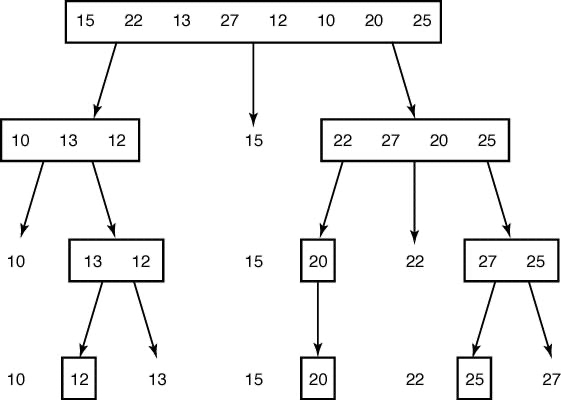

# Quick Sort (퀵 정렬)

> 분할 정복 접근법을 활용한 정렬 알고리즘

<br>

## 특징

* 퀵 정렬이란 용어는 오해의 여지가 있음. 왜냐하면 가장 빠른 정렬 알고리즘이 아니기 때문

* 분할 교환 정렬(partition exchange sort)이 더 정확하다.

<br>

## 아이디어

> 하나의 리스트를 **pivot**을 기준으로 두 개의 비균등한 크기로 분할하고 분할된 부분 리스트를 정렬한 다음, 두 개의 정렬된 부분 리스트를 합하여 전체가 정렬된 리스트가 되게 하는 방법이다.

1. **예외처리**
    - 리스트의 길이가 1 이하이면 이미 정렬된 것으로 판단하여 종료. 그렇지 않은 경우에는,

2. **분할(Divide)**
    - 정렬되지 않은 리스트를 피벗을 기준으로 비균등하게 2개의 부분 배열(피벗을 중심으로 왼쪽: 피벗보다 작은 요소들, 오른쪽: 피벗보다 큰 요소들)로 분할한다.

3. **정복(Conquer)**
    - 각 부분 리스트를 재귀적으로 합병 정렬을 이용해 정렬한다.

4. **조합(Combine)**
    - 두 부분 리스트를 다시 하나의 정렬된 리스트로 합병한다.

<br>

## 알고리즘 설계 및 구현

<p align="center">
  
</p>

### partition
1. 특정 기준으로 pivot 선택
2. pivot보다 작은 원소 중 가장 큰 인덱스를 담고있는 변수 j 초기화
3. 왼쪽(i)에서 오른쪽으로 가면서 pivot보다 작은 수 찾음
4. 작은 수를 찾으면 인덱스 i, j에 대한 요소를 교환
5. 3, 4번 과정 반복
6. 더이상 3번이 진행이 불가능하면, pivot이랑 인덱스 j에 대한 요소랑 교환
7. 이제 교환된 pivot 기준으로 왼쪽엔 pivot보다 작은 값, 오른쪽엔 큰 값들만 존재함

```python
def partition(arr: list[int], low: int, high: int) -> int:
    pivot = arr[low]    # 배열의 첫번째 원소를 pivot으로 선정
    j = low             # j : pivot보다 작은 원소중 가장 큰 인덱스

    for i in range(low + 1, high + 1): # 배열의 나머지 원소들을 pivot이랑 비교
        if arr[i] < pivot:
            j += 1
            arr[i], arr[j] = arr[j], arr[i]
    pivot_point = j
    arr[low], arr[pivot_point] = arr[pivot_point], arr[low]

    return pivot_point
```

> 15, 22, 13, 27, 12, 10, 20, 25 `초기값`  
>
> **15**, **22**, 13, 27, 12, 10, 20, 25  
> **15**, 22, **13**, 27, 12, 10, 20, 25 `swap`  
> **15**, <u>13</u>, <u>22</u>, **27**, 12, 10, 20, 25   
> **15**, 13, 22, 27, **12**, 10, 20, 25 `swap`  
> **15**, 13, <u>12</u>, 27, <u>22</u>, **10**, 20, 25 `swap`  
> **15**, 13, 12, <u>10</u>, 22, <u>27</u>, **20**, 25  
> **15**, 13, 12, 10, 22, 27, 20, **25**  
> <u>10</u>, 13, 12, <u>15</u>, 22, 27, 20, 25 `swap` `최종값`

<br>

## 시간 복잡도

pivot 선택 기준과 입력 값에 따라 크게 달라지므로, `불안정 정렬`이다.

|   평균   |   최악   |
| :------: | :------: |
| O(nlogn) |  O(n^2)  |

<br>

## Source Code
```python
# Quick Sort Algorithm
def quick_sort(arr: list[int], low: int, high: int) -> None:
    def partition(arr: list[int], low: int, high: int) -> int:
        pivot = arr[low]    # 배열의 첫번째 원소를 pivot으로 선정
        j = low             # j : pivot보다 작은 원소중 가장 큰 인덱스

        for i in range(low + 1, high + 1): # 배열의 나머지 원소들을 pivot이랑 비교
            if arr[i] < pivot:
                j += 1
                arr[i], arr[j] = arr[j], arr[i]
        pivot_point = j
        arr[low], arr[pivot_point] = arr[pivot_point], arr[low] # 

        return pivot_point

    if low < high:
        pivot_point = partition(arr, low, high)
        quick_sort(arr, low, pivot_point - 1)   
        quick_sort(arr, pivot_point+1, high)

# Testcase
arr = [3,5,2,9,10,14,4,8]
quick_sort(arr, 0, len(arr)-1)
print(arr)
```